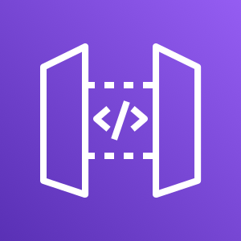
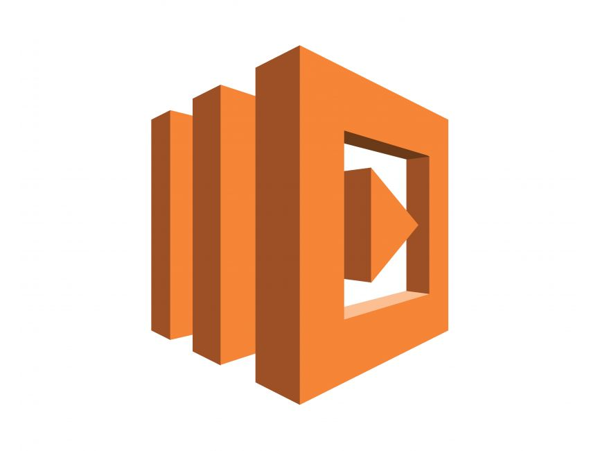

# AWS Lambda Function with API Gateway
<p align="center">
   
   

</p>
This Terraform project creates an AWS Lambda function written in Node.js, and exposes it via an API Gateway. The setup includes the necessary IAM role and policies for the Lambda function to execute and integrate with the API Gateway.

## Table of Contents

- [Introduction](#introduction)
- [Prerequisites](#prerequisites)
- [Installation](#installation)
- [Usage](#usage)
- [Resources](#resources)
- [Outputs](#outputs)
- [License](#license)

## Introduction

This project demonstrates how to use Terraform to deploy a simple AWS Lambda function and expose it through an API Gateway. The Lambda function returns a simple "Hello from AWS Lambda!" message when invoked. The API Gateway serves as the HTTP interface for invoking the Lambda function.

## Prerequisites

- [Terraform](https://www.terraform.io/downloads.html) installed on your machine.
- An AWS account with the necessary permissions to create IAM roles, Lambda functions, and API Gateway resources.
- AWS CLI configured with access to your AWS account.

## Installation

1. **Clone the repository**

2. **Initialize the Terraform project**:
   ```
   terraform init
   ```

3. **Review the Terraform plan**:
   ```
   terraform plan
   ```

4. **Apply the Terraform configuration**:
   ```
   terraform apply
   ```

   You will be prompted to confirm the application of the resources. Type `yes` to proceed.

## Usage

After applying the Terraform configuration, the API Gateway URL will be provided as an output. You can invoke the Lambda function using this URL.

Example:
```
curl https://<api-gateway-url>/mylambda
```

This should return:
```
{
  "message": "Hello from AWS Lambda!"
}
```

## Resources

This Terraform configuration creates the following AWS resources:

- **AWS Lambda Function**: A Node.js function that returns a simple message.
- **IAM Role and Policy**: Role with basic execution permissions for the Lambda function.
- **API Gateway**: Exposes the Lambda function via a RESTful API.
- **API Gateway Resources and Methods**: Defines the path and method for invoking the Lambda function.

## Outputs

- **API Gateway URL**: The base URL of the deployed API Gateway with the path to invoke the Lambda function.

## License

This project is licensed under the MIT License - see the [LICENSE](LICENSE) file for details.
